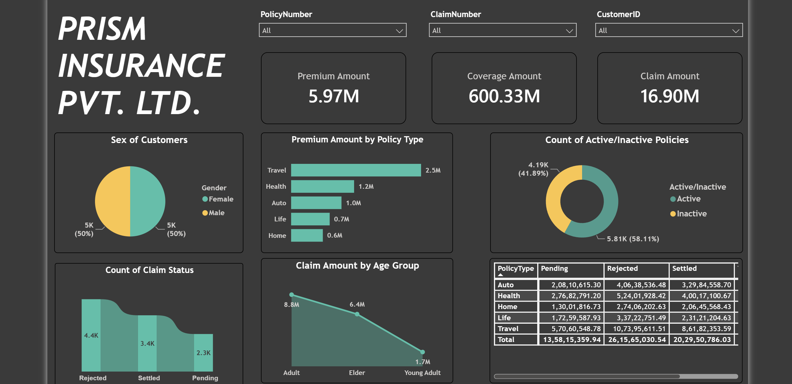
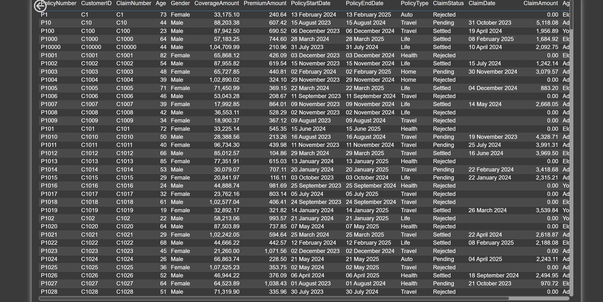
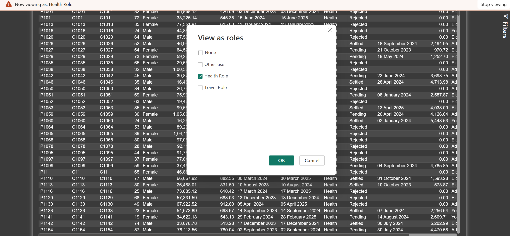
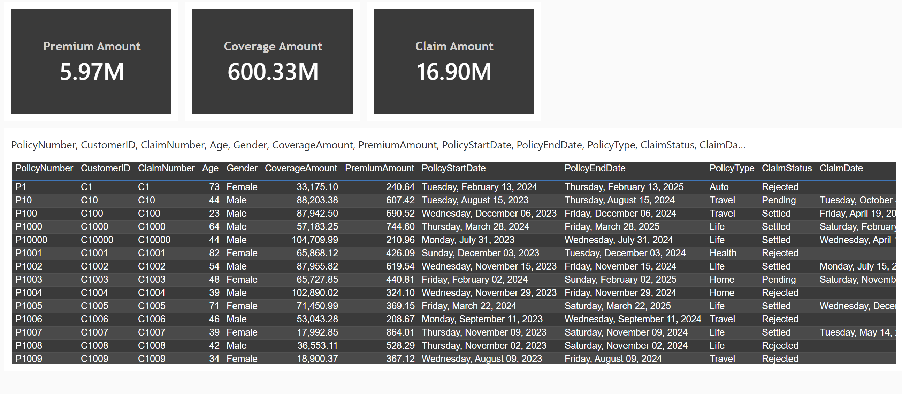
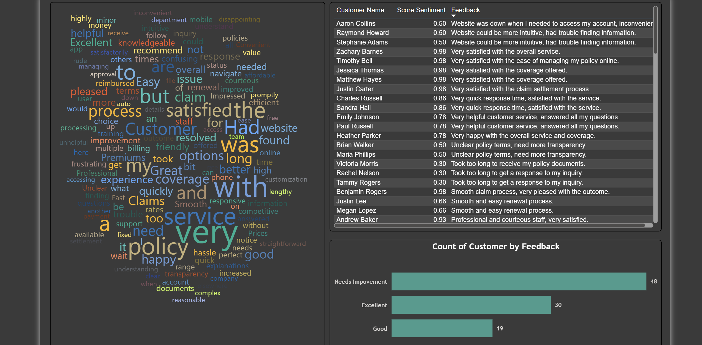

# Insurance-Data-Analysis

## Problem Statement

This dashboard helps the insurance company understand its customers, policies, premiums, coverage, and claims through interactive visualizations. It provides insights into different policy types, active and inactive policies, claim statuses, customer demographics, and claim amounts across age groups.

The dashboard also analyzes customer feedback using sentiment scores to identify whether customers are giving **Excellent, Good, or Needs Improvement** feedback. This helps the company identify areas where customer experience can be improved.

Since **Travel policies contribute the highest premium amount (2.5M)** and **Rejected claims have the highest claim count (approximately 4.4K)**, these areas require closer attention. Also, the **Adult age group contributes the highest claim amount (approximately 8.8M)**, providing useful insight into the customer groups contributing most to claims.

Thus, the dashboard helps the insurance company **monitor its overall performance, identify important patterns, and make better data-driven decisions**.
## Data Source
Microsoft SQL Server

### Steps followed

- **Step 1: Create Insurance Database**
  - Open Microsoft SQL Server and create a database named `InsuranceDB`.

- **Step 2: Import Insurance Data**
  - Right-click on `InsuranceDB` → **Tasks** → **Import Flat File**.
  - Browse and select the Insurance Data CSV file.

- **Step 3: Correct Policy Number Data Type**
  - Change the **Policy Number** data type from `Money` to `varchar(max)` so that policy numbers are treated as identifiers rather than monetary values.

- **Step 4: Verify Data Import**
  - Complete the import process and verify the imported table using:
    `SELECT * FROM dbo.InsuranceData`

- **Step 5: Connect Power BI to SQL Server**
  - Open Power BI Desktop and select **SQL Server** as the data source.
  - Enter the required server details and select **Import** as the connectivity mode.

- **Step 6: Load Data through Power Query**
  - Select the `InsuranceData` table and choose **Transform Data** to open Power Query Editor.

- **Step 7: Data Profiling and Quality Check**
  - Use **Column Quality, Column Distribution, and Column Profile** to inspect errors, empty values, distinct values, and unique values.

- **Step 8: Remove Duplicate Policy Numbers**
  - Remove duplicate values from the **Policy Number** column.
  - A candidate primary key should contain unique and non-null values.

- **Step 9: Analyze Age Column**
  - Change the **Age** data type to **Whole Number** and use sorting to identify the minimum and maximum ages.

- **Step 10: Handle Claim Date**
  - Change the **Claim Date** data type to **Date**.
  - Column profiling showed approximately **44% empty values**.

- **Step 11: Apply Transformations**
  - Select **Close & Apply** to load the transformed data into Power BI.

- **Step 12: Apply Dashboard Theme**
  - In Report View, open **Themes** from the View tab and apply the required dashboard theme.

- **Step 13: Add Dashboard Slicers**
  - Add slicers for **Policy Number, Claim Number, and Customer ID**.
  - Change the slicer style to **Dropdown** and align the slicers using the Format options.

- **Step 14: Add Company Name**
  - Insert a text box containing **Prism Insurance Pvt. Ltd.**

- **Step 15: Add Financial Summary Cards**
  - Add Card visuals for **Premium Amount, Coverage Amount, and Claim Amount**.
  - Display their respective sums and rename the card titles accordingly.

- **Step 16: Customer Gender Distribution**
  - Add a **Donut Chart** to represent the number of customers by gender.
  - Use **Gender** as the legend and **Count of Gender** as the value.

- **Step 17: Claim Status Distribution**
  - Add a **Ribbon Chart** to represent the count of claims by **Claim Status**.
  - Enable **Data Labels** to display the values.

- **Step 18: Dashboard Filtering**
  - Use the slicers and visual interactions to filter the dashboard and observe the corresponding changes across visuals.

- **Step 19: Premium Amount by Policy Type**
  - Add a stacked bar chart to represent the **sum of Premium Amount for different Policy Types**.
  - Set **Policy Type** on the Y-axis and **Sum of Premium Amount** on the X-axis.
  - Format the visual as required.

- **Step 20: Create Age Group Column**
  - Since the dataset contains an **Age** column but no Age Group column, create a new **Age Group** column using Conditional Column in Power Query Editor.
  - Create the following groups:
    - Age ≤ 24 → **Young Adults**
    - Age ≤ 60 → **Adult**
    - Otherwise → **Elder**
  - Set the new column's data type to **Text** and load the changes.

- **Step 21: Claim Amount by Age Group**
  - Add a line chart to represent the **sum of Claim Amount for different Age Groups**.
  - Use **Age Group** and **Sum of Claim Amount** to create the visual.

- **Step 22: Create Active/Inactive Policy Column**
  - In Power Query Editor, create a Conditional Column named **Active/Inactive**.
  - If **Policy End Date** is before or equal to **10-12-2024**, classify the policy as **Inactive**; otherwise, classify it as **Active**.
  - Set the new column as Text and select **Close & Apply**.

- **Step 23: Active vs Inactive Policies**
  - Add a Donut Chart to represent the **count of Active and Inactive Policies**.
  - Use **Active/Inactive** as the legend and **Count of Active/Inactive** as the value.

- **Step 24: Claim Coverage by Policy Type and Claim Status**
  - Add a Matrix visual to represent **Coverage Amount across different Policy Types and Claim Statuses**.
  - Use **Policy Type** as Rows, **Claim Status** as Columns, and **Coverage Amount** as Values.

- **Step 25: Publish Report to Power BI Service**
  - From Power BI Desktop, select **Publish** and publish the report to the required workspace in Power BI Service.

- **Step 26: Configure Scheduled Refresh**
  - In Power BI Service, open the published **Semantic Model** and select **Scheduled Refresh**.
  - The refresh and data source credential options were initially unavailable because no data gateway was configured.

- **Step 27: Install Personal Mode Data Gateway**
  - Install and configure the **On-premises Data Gateway (Personal Mode)** to enable communication between the SQL Server data source and Power BI Service.
  - Sign in with the required Power BI account and verify that the gateway is online and ready to use.

- **Step 28: Configure Data Source Credentials**
  - After installing the gateway, configure the required **data source credentials** and authentication settings to establish the connection with SQL Server.

- **Step 29: Schedule Dataset Refresh**
  - Under **Scheduled Refresh**, set the time zone to **UTC+05:30** and select **Daily** refresh frequency.
  - Schedule the dataset to refresh at **2:30 AM**.

- **Step 30: Test Scheduled Refresh**
  - Make changes to the source dataset and verify whether the changes are reflected in Power BI Service after the scheduled refresh.
  - This is used to confirm that the scheduled refresh is working correctly.  

- **Step 31: Create Drill-Through Detail Page**
  - Add a new report page to display the detailed records used for analysis.
  - Add a **Table** visual and select all required columns.
  - Set the columns to **Do Not Summarize** where applicable.

- **Step 32: Format Date Fields**
  - For **Policy End Date, Policy Start Date, and Claim Date**, remove the automatic date hierarchy and use the actual date field to display only the date.

- **Step 33: Add Policy Type as Drill-Through Field**
  - In the Drill-through section of the new page, drag and drop **Policy Type** into the **Drill-through fields** area.

- **Step 34: Drill Through from Policy Type**
  - On the main dashboard, right-click a **Policy Type** category in the **Premium Amount by Policy Type** bar chart.
  - Select **Drill through** and navigate to the detail page to view records filtered by the selected Policy Type.

- **Step 35: Return to Main Dashboard**
  - Use the **Back** button on the detail page to return to the page from which the drill-through was initiated.

 - **Step 36: Test Scheduled Refresh**
  - In Power BI Service, open the **Semantic Model** and select **Scheduled Refresh**.
  - Check the **Last Refreshed, Next Refresh, and Refresh History** details.
  - Modify the source dataset, such as changing the number of Male or Female records, and verify that the changes are reflected after the dataset refresh.

- **Step 37: Republish Report Changes**
  - Changes made to the report structure, such as adding a new page, adding visuals, or modifying visual formatting, require the report to be published again to Power BI Service.
  - From Power BI Desktop, select **Publish**, choose the existing dataset, select **Replace**, and publish the updated report.

- **Step 38: Verify Updated Report and Scheduled Refresh**
  - Verify that the newly published second page and report changes are reflected in Power BI Service.
  - Confirm that the scheduled refresh continues to update the underlying dataset as configured. 

- **Step 39: Create Role-Level Security (RLS) Roles**
  - In Power BI Desktop, go to **Modeling → Manage Roles** and create a role named **Travel Role**.
  - Apply a filter on the `Policy Type` column where the value equals **Travel**.
  - Create a second role named **Health Role** with the `Policy Type` value equal to **Health**.

- **Step 40: Test RLS in Power BI Desktop**
  - Go to **Modeling → View As Roles** and select **Travel Role** to verify that the report displays only Travel-related data.
  - Stop viewing the role and repeat the test for **Health Role**.

- **Step 41: Validate RLS in Power BI Service**
  - After publishing the report, open the Semantic Model in Power BI Service and select **Security**.
  - Verify the configured **Travel Role** and **Health Role** and use the role-viewing option to validate the applied filters.

- **Step 42: Create Power BI Dashboard**
  - Pin important visuals from the published report to a new Power BI Dashboard.
  - Add selected Card visuals from the main report page and the required visual from the detail page to the dashboard.
  - Use the dashboard to present key information at a glance, while the report provides detailed analysis across multiple pages.
  

- **Step 43: Load Customer Feedback Data**
  - Get the customer feedback Excel file and load it into Power BI Desktop.
  - Use **Transform Data** to open Power Query Editor.

- **Step 44: Perform Sentiment Analysis**
  - In Power Query Editor, apply **Text Analytics** to the **Feedback** column to generate a sentiment score.
  - Create the **Score Sentiment** column to quantify the received customer feedback.

- **Step 45: Create Feedback Categories**
  - Add a Conditional Column named **Feedback Category** based on the `Score Sentiment` value.
  - Apply the following classification:
    - Score ≥ 0.8 → **Excellent**
    - Score ≥ 0.6 → **Good**
    - Otherwise → **Needs Improvement**

- **Step 46: Create Sentiment Analysis Page**
  - Add a new report page dedicated to **Customer Feedback Sentiment Analysis**.

- **Step 47: Create Customer Feedback Word Cloud**
  - Import the **Word Cloud** custom visual from Microsoft Corporation using **Get More Visuals**.
  - Use **Feedback** as the Category and **Feedback Count** as the Value.
  - Format the visual to display frequently occurring words more prominently.

- **Step 48: Customer Feedback Category Analysis**
  - Add a stacked bar chart to represent the **number of customers across feedback categories**.
  - Use **Feedback Category** on the Y-axis and **Count of Customer Name** on the X-axis.

- **Step 49: Customer Sentiment Details**
  - Add a Table visual to display **Customer Name, Sentiment Score, and Feedback**.
  - Set the fields to **Do Not Summarize** where applicable.

- **Step 50: Interactive Sentiment Analysis**
  - Use the Word Cloud and other visuals as interactive filters to observe corresponding changes across the sentiment analysis page.

- **Step 51: Publish Sentiment Analysis Report**
  - Sign in to Power BI and publish the updated report to Power BI Service. 

  

## Insights

The Insurance Data Analysis report was created using Power BI Desktop and published to Power BI Service. The dashboard provides insights into customers, policies, premiums, coverage, claims, and customer feedback.

Following inferences can be drawn from the dashboard:

### [1] Overall Insurance Portfolio

- Total Premium Amount = **5.97M**
- Total Coverage Amount = **600.33M**
- Total Claim Amount = **16.90M**

Thus, the dashboard provides an overall view of the premium, coverage, and claim amounts.

### [2] Customer Demographics

- Female customers account for **50%** of the customer base.
- Male customers account for **50%** of the customer base.

Thus, the customer base is evenly distributed by gender.

### [3] Premium Amount by Policy Type

- Travel policies contribute the highest premium amount at **2.5M**.
- Health policies contribute **1.2M**.
- Auto policies contribute **1.0M**.
- Life policies contribute **0.7M**.
- Home policies contribute **0.6M**.

Thus, **Travel** is the leading policy type in terms of premium amount.

### [4] Active and Inactive Policies

- **58.11%** of policies are Active.
- **41.89%** of policies are Inactive.

Thus, Active policies form the majority of the insurance portfolio.

### [5] Claim Status

- Rejected claims = **4.4K**
- Settled claims = **3.4K**
- Pending claims = **2.3K**

Thus, **Rejected** claims have the highest count among the three claim statuses.

### [6] Claim Amount by Age Group

- Adult customers contribute a claim amount of approximately **8.8M**.
- Elder customers contribute approximately **6.4M**.
- Young Adult customers contribute approximately **1.7M**.

Thus, the **Adult** age group contributes the highest claim amount.

### [7] Customer Feedback Analysis

- **Needs Improvement** feedback = **48**
- **Excellent** feedback = **30**
- **Good** feedback = **19**

Thus, **Needs Improvement** is the most frequent feedback category and indicates areas where customer experience can be improved.

The Word Cloud further highlights frequently occurring words in customer feedback, helping identify common themes in customer experiences.

### [8] Interactive Analysis

- Slicers for **Policy Number, Claim Number, and Customer ID** allow users to filter the report dynamically.
- Drill-through functionality allows users to view detailed records for a selected **Policy Type**.
- Role-Level Security restricts access to data based on the assigned **Policy Type** role.
- Scheduled Refresh allows the dataset to be updated automatically from the connected SQL Server source.